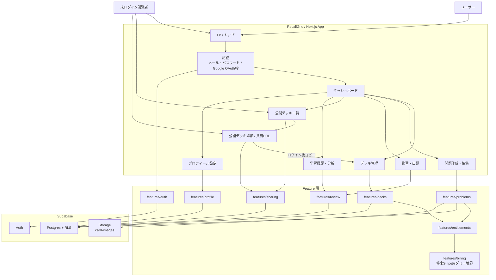
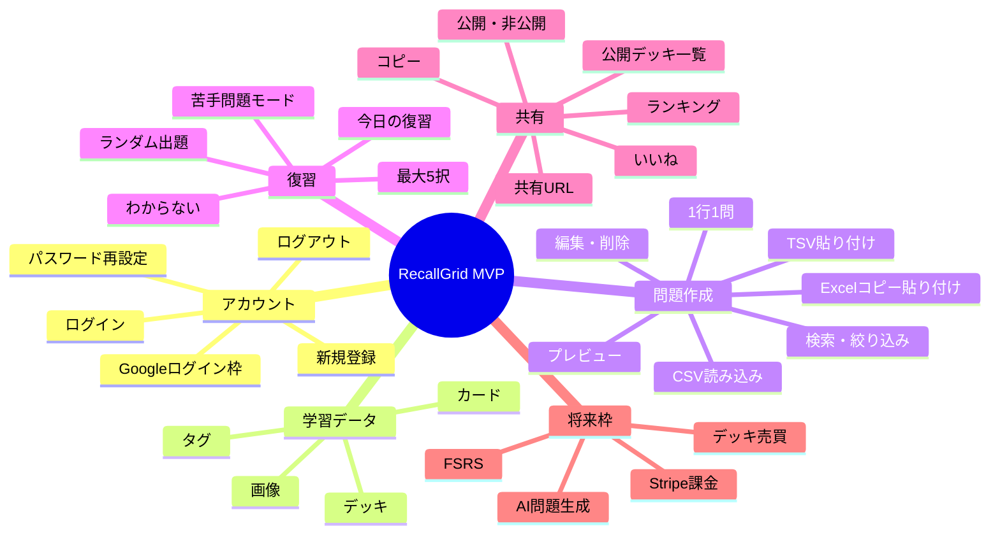
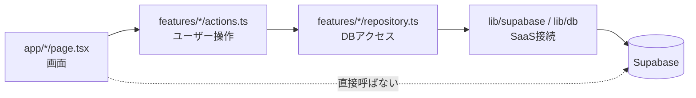

# 01. プロダクト鳥観図

RecallGrid は、個人の暗記学習を軸にしながら、無料の公開デッキ共有までを MVP に含める構成です。

```mermaid
flowchart TB
  User["ユーザー"]
  Guest["未ログイン閲覧者"]

  subgraph App["RecallGrid / Next.js App"]
    Landing["LP / トップ"]
    Auth["認証\nメール・パスワード / Google OAuth枠"]
    Dashboard["ダッシュボード"]
    Decks["デッキ管理"]
    Problems["問題作成・編集"]
    Review["復習・出題"]
    Explore["公開デッキ一覧"]
    Share["公開デッキ詳細 / 共有URL"]
    Analytics["学習履歴・分析"]
    Settings["プロフィール設定"]
  end

  subgraph Features["Feature 層"]
    AuthFeature["features/auth"]
    DeckFeature["features/decks"]
    ProblemFeature["features/problems"]
    ReviewFeature["features/review"]
    SharingFeature["features/sharing"]
    ProfileFeature["features/profile"]
    EntitlementFeature["features/entitlements"]
    BillingBoundary["features/billing\n将来Stripe用ダミー境界"]
  end

  subgraph Supabase["Supabase"]
    SupabaseAuth["Auth"]
    Postgres["Postgres + RLS"]
    Storage["Storage\ncard-images"]
  end

  User --> Landing
  Guest --> Landing
  Guest --> Explore
  Guest --> Share
  Landing --> Auth
  Auth --> Dashboard
  Dashboard --> Decks
  Dashboard --> Problems
  Dashboard --> Review
  Dashboard --> Explore
  Dashboard --> Analytics
  Dashboard --> Settings
  Explore --> Share
  Share -->|"ログイン後コピー"| Decks

  Auth --> AuthFeature
  Decks --> DeckFeature
  Problems --> ProblemFeature
  Review --> ReviewFeature
  Explore --> SharingFeature
  Share --> SharingFeature
  Analytics --> ReviewFeature
  Settings --> ProfileFeature

  DeckFeature --> EntitlementFeature
  ProblemFeature --> EntitlementFeature
  EntitlementFeature --> BillingBoundary

  AuthFeature --> SupabaseAuth
  DeckFeature --> Postgres
  ProblemFeature --> Postgres
  ProblemFeature --> Storage
  ReviewFeature --> Postgres
  SharingFeature --> Postgres
  ProfileFeature --> Postgres
```

## MVP の中心

```mermaid
mindmap
  root((RecallGrid MVP))
    アカウント
      新規登録
      ログイン
      ログアウト
      パスワード再設定
      Googleログイン枠
    学習データ
      デッキ
      カード
      タグ
      画像
    問題作成
      1行1問
      TSV貼り付け
      CSV読み込み
      Excelコピー貼り付け
      プレビュー
      検索・絞り込み
      編集・削除
    復習
      今日の復習
      ランダム出題
      最大5択
      わからない
      苦手問題モード
    共有
      公開・非公開
      共有URL
      公開デッキ一覧
      コピー
      ランキング
      いいね
    将来枠
      Stripe課金
      AI問題生成
      FSRS
      デッキ売買
```

## 設計の境界

```mermaid
flowchart LR
  Page["app/*/page.tsx\n画面"]
  Action["features/*/actions.ts\nユーザー操作"]
  Repo["features/*/repository.ts\nDBアクセス"]
  Lib["lib/supabase / lib/db\nSaaS接続"]
  DB[("Supabase")]

  Page --> Action --> Repo --> Lib --> DB

  Page -.直接呼ばない.-> DB
```

画面から Supabase や将来の Stripe を直接呼ばず、`features` を通すことで、無料 MVP から課金・AI 追加へ拡張しやすくしています。
