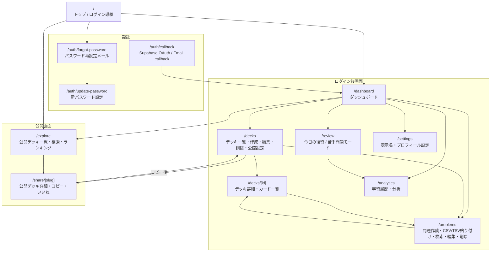
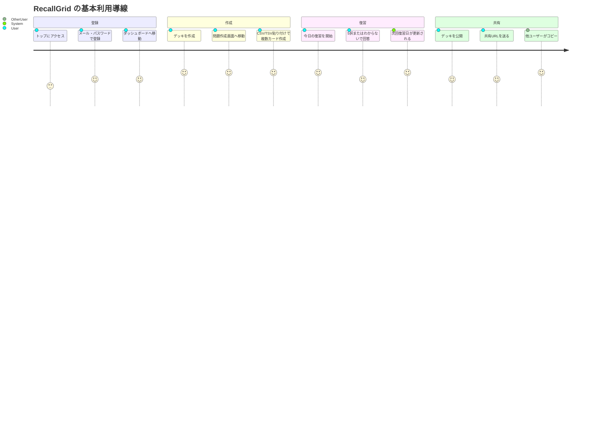

# 02. 画面鳥観図

現在の主要画面と URL の鳥観図です。

## 画面別の役割

| 画面 | 主な役割 | 認証 |
| --- | --- | --- |
| `/` | トップ、ログイン・登録フォームへの入口 | 任意 |
| `/dashboard` | 復習数、デッキ数、カード数、最近のデッキ | 必須 |
| `/decks` | デッキ作成、一覧、編集、削除、公開設定 | 必須 |
| `/decks/[id]` | デッキ詳細、登録カード確認 | 必須 |
| `/problems` | 複数問題入力、CSV/TSV貼り付け、CSV読み込み、検索、編集、削除 | 必須 |
| `/review` | ランダム出題、選択肢回答、復習ログ保存 | 必須 |
| `/analytics` | 復習履歴、正答率、直近推移 | 必須 |
| `/settings` | 公開表示名などプロフィール設定 | 必須 |
| `/explore` | 公開デッキ一覧、ランキング、タグ絞り込み | 任意 |
| `/share/[slug]` | 公開デッキ詳細、コピー、いいね | 任意 / コピーは必須 |
| `/auth/forgot-password` | パスワード再設定メール送信 | 任意 |
| `/auth/update-password` | 新しいパスワード設定 | 任意 |

## 代表的なユーザー導線

