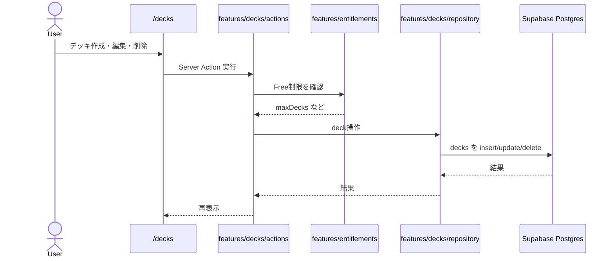
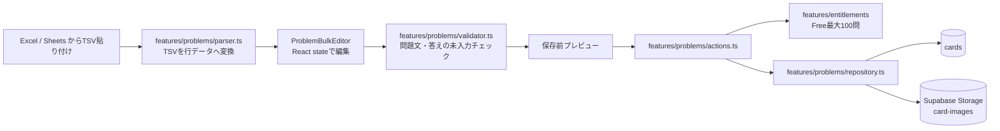
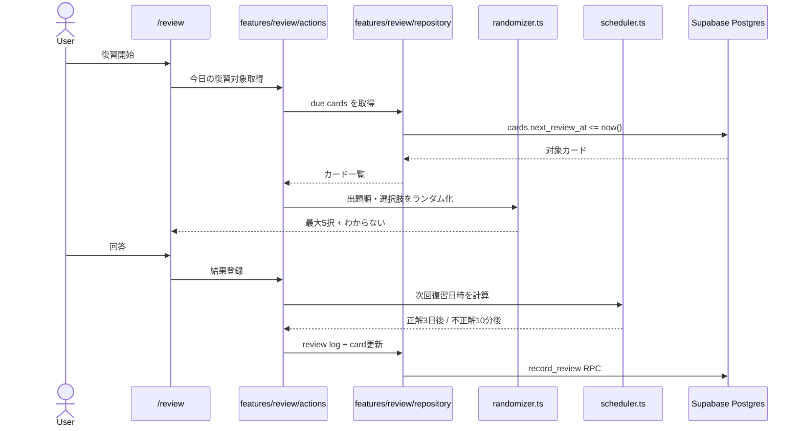
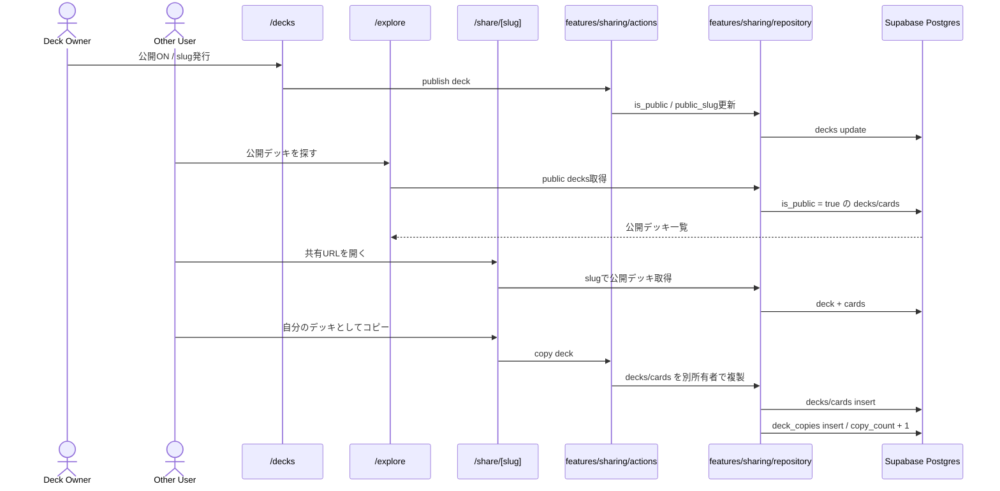
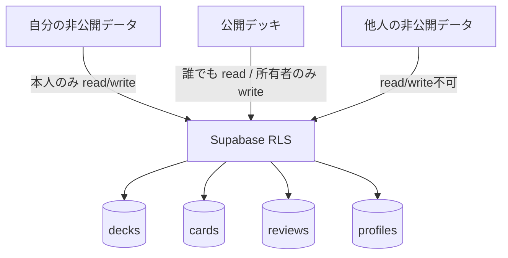

# 03. 機能・データフロー鳥観図

画面操作から feature 層、Supabase までの流れです。

## デッキ作成・編集

```mermaid
sequenceDiagram
  actor U as User
  participant P as /decks
  participant A as features/decks/actions
  participant E as features/entitlements
  participant R as features/decks/repository
  participant DB as Supabase Postgres

  U->>P: デッキ作成・編集・削除
  P->>A: Server Action 実行
  A->>E: Free制限を確認
  E-->>A: maxDecks など
  A->>R: deck操作
  R->>DB: decks を insert/update/delete
  DB-->>R: 結果
  R-->>A: 結果
  A-->>P: 再表示
```

## 問題作成・TSV 貼り付け

```mermaid
flowchart LR
  Paste["Excel / Sheets からTSV貼り付け"]
  Parser["features/problems/parser.ts\nTSVを行データへ変換"]
  Editor["ProblemBulkEditor\nReact stateで編集"]
  Validator["features/problems/validator.ts\n問題文・答えの未入力チェック"]
  Preview["保存前プレビュー"]
  Action["features/problems/actions.ts"]
  Entitlement["features/entitlements\nFree最大100問"]
  Repository["features/problems/repository.ts"]
  DB[("cards")]
  Storage[("Supabase Storage\ncard-images")]

  Paste --> Parser --> Editor
  Editor --> Validator
  Validator --> Preview
  Preview --> Action
  Action --> Entitlement
  Action --> Repository
  Repository --> DB
  Repository --> Storage
```

## 復習・出題

```mermaid
sequenceDiagram
  actor U as User
  participant P as /review
  participant A as features/review/actions
  participant Repo as features/review/repository
  participant Rand as randomizer.ts
  participant Sch as scheduler.ts
  participant DB as Supabase Postgres

  U->>P: 復習開始
  P->>A: 今日の復習対象取得
  A->>Repo: due cards を取得
  Repo->>DB: cards.next_review_at <= now()
  DB-->>Repo: 対象カード
  Repo-->>A: カード一覧
  A->>Rand: 出題順・選択肢をランダム化
  Rand-->>P: 最大5択 + わからない
  U->>P: 回答
  P->>A: 結果登録
  A->>Sch: 次回復習日時を計算
  Sch-->>A: 正解3日後 / 不正解10分後
  A->>Repo: review log + card更新
  Repo->>DB: record_review RPC
```

## 公開デッキ・コピー

```mermaid
sequenceDiagram
  actor Owner as Deck Owner
  actor Viewer as Other User
  participant Decks as /decks
  participant Explore as /explore
  participant Share as /share/[slug]
  participant Actions as features/sharing/actions
  participant Repo as features/sharing/repository
  participant DB as Supabase Postgres

  Owner->>Decks: 公開ON / slug発行
  Decks->>Actions: publish deck
  Actions->>Repo: is_public / public_slug更新
  Repo->>DB: decks update

  Viewer->>Explore: 公開デッキを探す
  Explore->>Repo: public decks取得
  Repo->>DB: is_public = true の decks/cards
  DB-->>Explore: 公開デッキ一覧

  Viewer->>Share: 共有URLを開く
  Share->>Repo: slugで公開デッキ取得
  Repo->>DB: deck + cards
  Viewer->>Share: 自分のデッキとしてコピー
  Share->>Actions: copy deck
  Actions->>Repo: decks/cards を別所有者で複製
  Repo->>DB: decks/cards insert
  Repo->>DB: deck_copies insert / copy_count + 1
```

## 権限制御の考え方

```mermaid
flowchart TB
  UserData["自分の非公開データ"]
  PublicDeck["公開デッキ"]
  OtherPrivate["他人の非公開データ"]

  RLS["Supabase RLS"]

  UserData -->|"本人のみ read/write"| RLS
  PublicDeck -->|"誰でも read / 所有者のみ write"| RLS
  OtherPrivate -->|"read/write不可"| RLS

  RLS --> Decks[("decks")]
  RLS --> Cards[("cards")]
  RLS --> Reviews[("reviews")]
  RLS --> Profiles[("profiles")]
```
