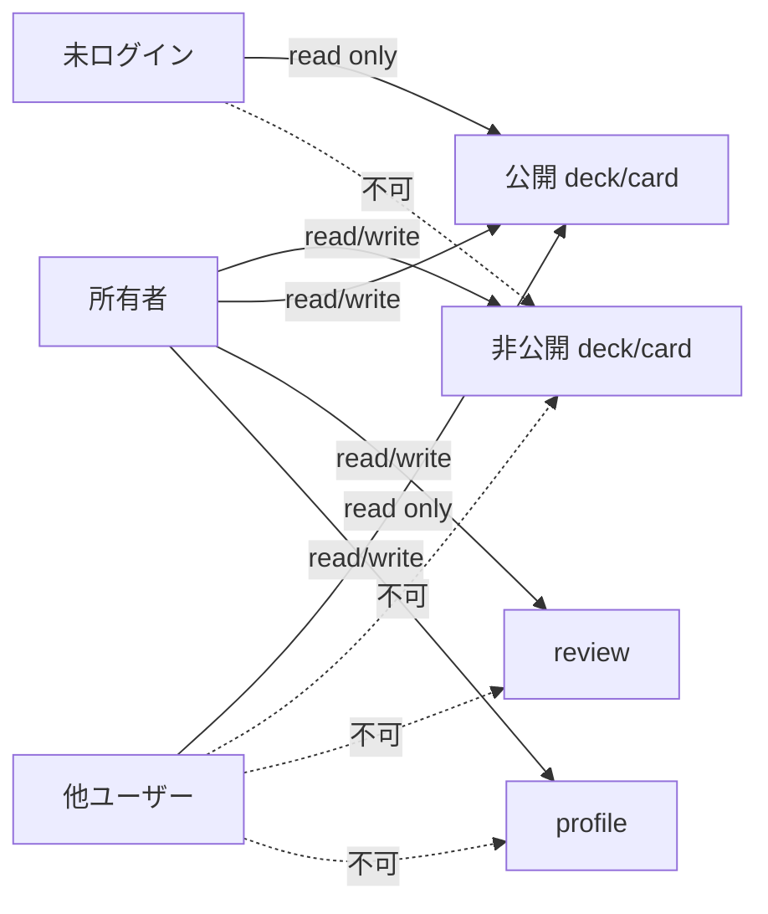

# 04. ER図

Supabase Postgres の主要テーブル関係です。

```mermaid
erDiagram
  AUTH_USERS ||--|| PROFILES : "has"
  AUTH_USERS ||--o{ DECKS : "owns"
  AUTH_USERS ||--o{ CARDS : "owns"
  AUTH_USERS ||--o{ REVIEWS : "writes"
  AUTH_USERS ||--o{ DECK_COPIES : "copies"
  AUTH_USERS ||--o{ DECK_LIKES : "likes"

  DECKS ||--o{ CARDS : "contains"
  DECKS ||--o{ DECK_COPIES : "source"
  DECKS ||--o{ DECK_COPIES : "copied"
  DECKS ||--o{ DECK_LIKES : "liked"
  DECKS ||--o{ DECKS : "copied_from"

  CARDS ||--o{ REVIEWS : "reviewed"

  AUTH_USERS {
    uuid id PK
    text email
  }

  PROFILES {
    uuid id PK
    uuid user_id FK
    plan_type plan
    boolean ai_enabled
    text display_name
    text stripe_customer_id
    text subscription_status
    timestamptz created_at
    timestamptz updated_at
  }

  DECKS {
    uuid id PK
    uuid user_id FK
    text name
    text title
    text description
    boolean is_public
    text public_slug
    boolean sharing_enabled
    text share_slug
    uuid copied_from_deck_id FK
    integer copy_count
    integer like_count
    text category
    text author_name
    timestamptz created_at
    timestamptz updated_at
  }

  CARDS {
    uuid id PK
    uuid user_id FK
    uuid deck_id FK
    text front
    text back
    text explanation
    text_array tags
    text image_path
    timestamptz next_review_at
    real stability
    real difficulty
    integer reps
    integer lapses
    timestamptz created_at
    timestamptz updated_at
  }

  REVIEWS {
    uuid id PK
    uuid user_id FK
    uuid card_id FK
    review_result result
    timestamptz reviewed_at
    timestamptz next_review_at
  }

  DECK_COPIES {
    uuid id PK
    uuid source_deck_id FK
    uuid copied_deck_id FK
    uuid copied_by_user_id FK
    timestamptz created_at
  }

  DECK_LIKES {
    uuid id PK
    uuid deck_id FK
    uuid user_id FK
    timestamptz created_at
  }
```

## テーブル責務

| テーブル | 役割 |
| --- | --- |
| `profiles` | 公開表示名、将来拡張用の内部カラム |
| `decks` | デッキ本体。公開・共有URL・コピー数・いいね数も保持 |
| `cards` | 問題カード本体。画像、タグ、次回復習日時、簡易復習状態も保持 |
| `reviews` | 復習ログ。回答結果とその時点の次回復習日を記録 |
| `deck_copies` | 公開デッキをコピーした履歴 |
| `deck_likes` | 公開デッキへのいいね |
| `storage.objects` | `card-images` バケットに画像を保存 |

## RLS の基本方針

## 将来拡張の置き場所

| 将来機能 | 既にある受け皿 |
| --- | --- |
| Stripe 課金 | `profiles` の内部カラム、`features/billing` |
| AI 問題生成 | `profiles.ai_enabled`, `features/entitlements` |
| 高度な復習アルゴリズム | `cards.stability`, `difficulty`, `reps`, `lapses`, `features/review/scheduler.ts` |
| デッキ売買 | 現時点では未実装。将来は `decks` と別に listing/order 系テーブルを追加 |
